### AJAX 특징

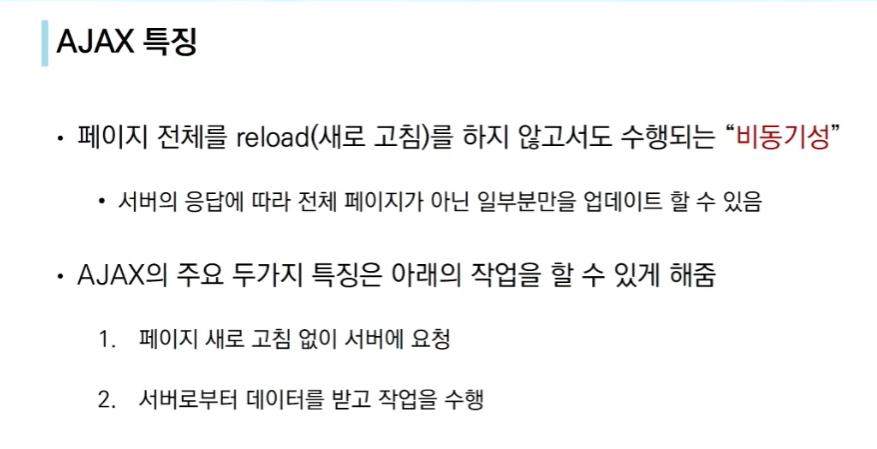


---


-> 새로 고침 없이 수행되는 비동기성의 예

-> INPUT 태그에 즉 검색창에 KEY 입력이 주어졌을 때(이벤트) 계속적으로 요청을 받아서 새로고침없이 업데이트 하는 기능임(브라우저가 열일하면서 서버에서 받아온 정보를 그려주는 거임)


------------

### 기다려주지 않는 JS

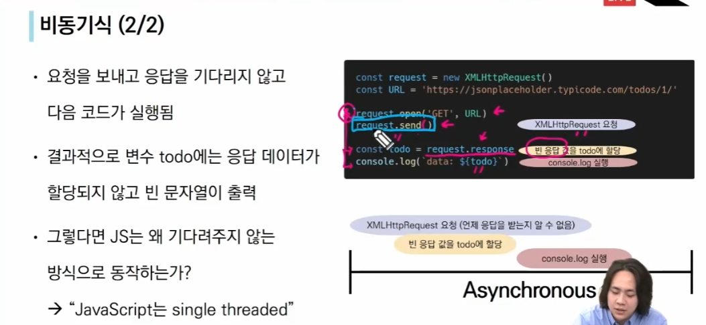


-----


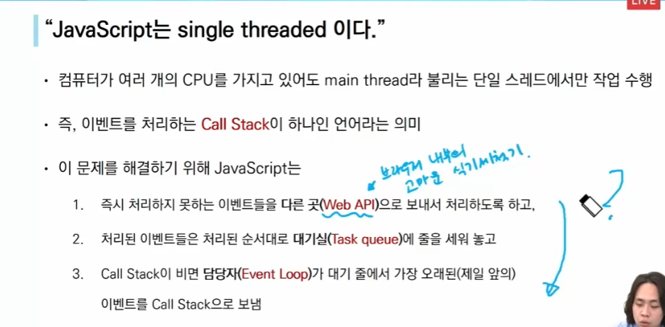


------


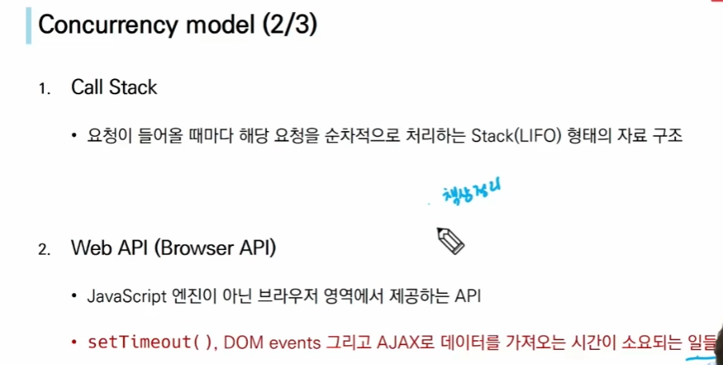

-> 비동기 요청 처럼 언제 끝날지 모르는 것은 WEB API가 담당해줌


-----

### 순차적인 비동기 처리

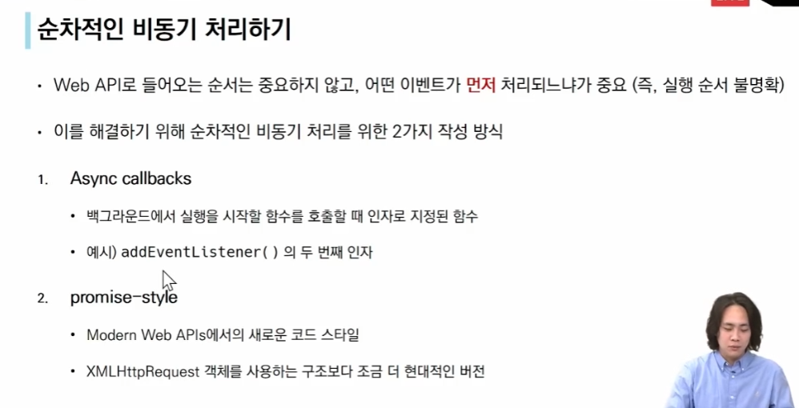


클릭언제 될지 몰라 근데 클릭되면 이거해줘

언제 끝날지 몰라 근데 끝나면 이거해줘!

----


### 콜백함수

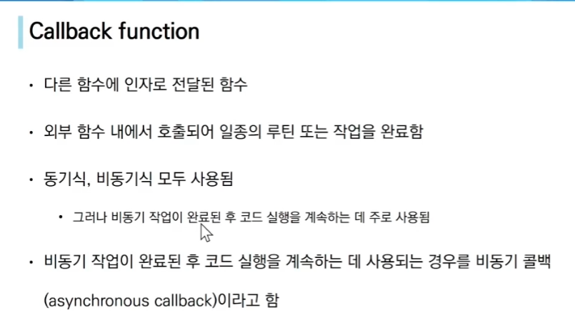

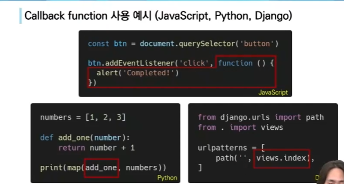


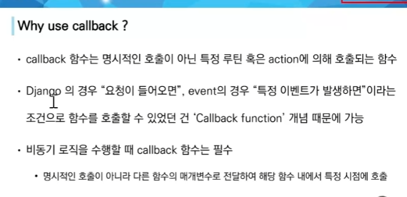

----

### 일급객체 함수

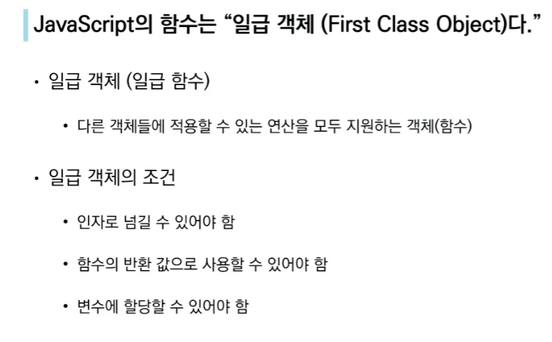


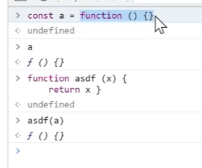


-----

### Promise

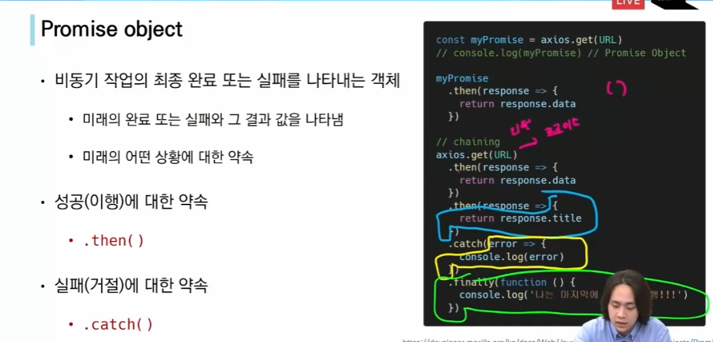


빨간색 성공하면 이어서 파란거 할거야 근데 빨간색이랑 파란색 작업중에 중간에 뭐 잘못되면 노란색할거야 그리고 성공했든 망했든 난 마지막에 초록색 수행할거야 -> 일종의 method chaining


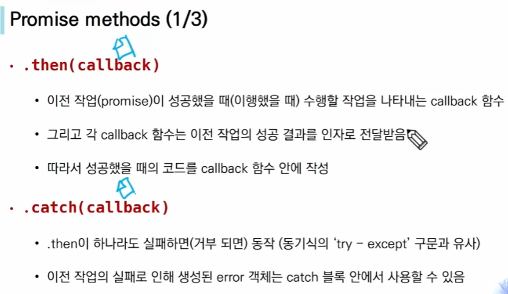

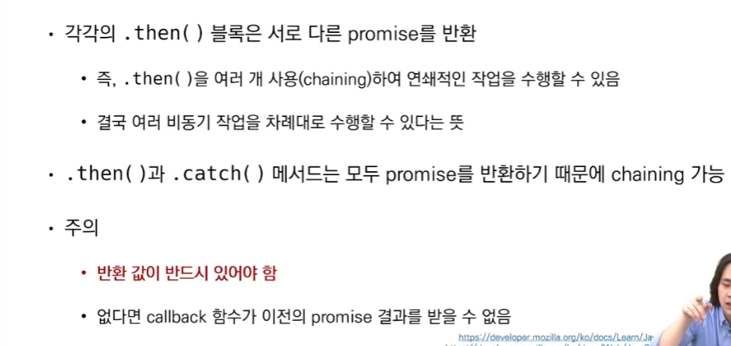

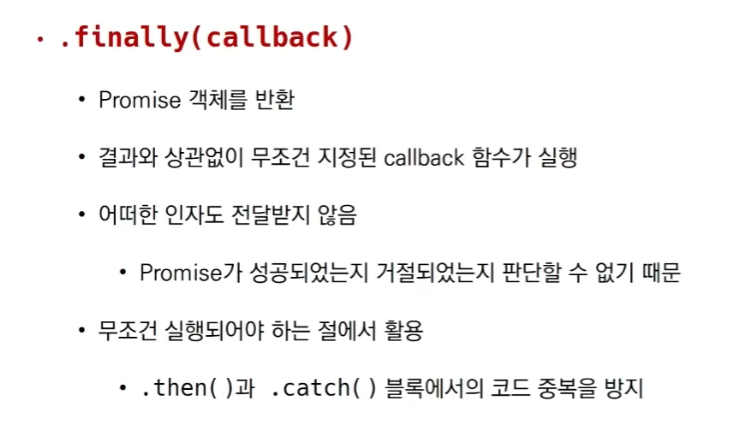


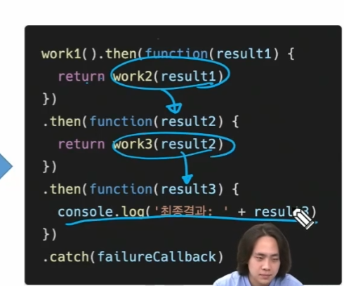


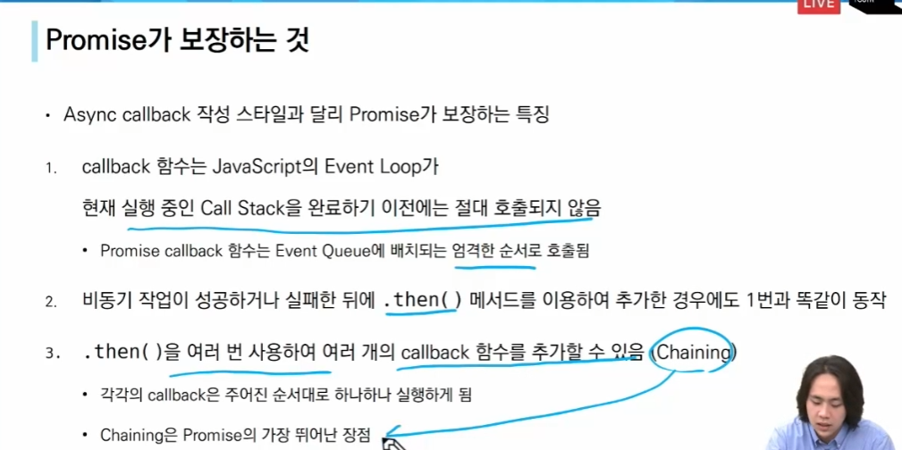

---------------


https://axios-http.com/kr/docs/intro

axios CDN

```
<script src="https://unpkg.com/axios/dist/axios.min.js"></script>
```

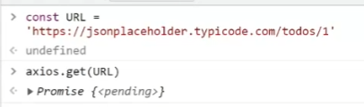

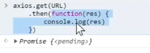

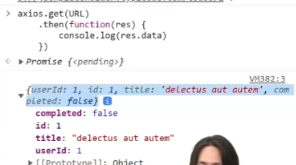


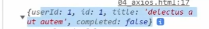

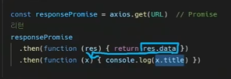

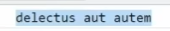


