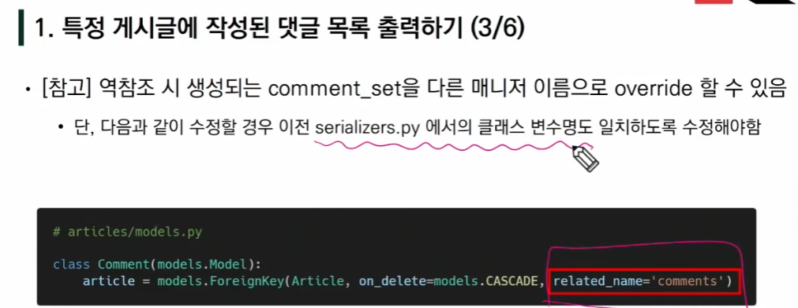

### shell plus에서 시리얼라이저 데이터 출력 확인 가능

------

### 포스트맨으로 포스트 요청 보낼 때

-----

### 1:N 관계인 게시글에 달린 댓글을 겟 요청 보내보면 Json 안에 foreign_key에 대한 정보가 담겨있다

#### key 값이 내가 모델에서 설정해준 값임을 확인 할 수 있다.

----

### 역참조 시 사용할 이름 바꾸고 싶을 때

